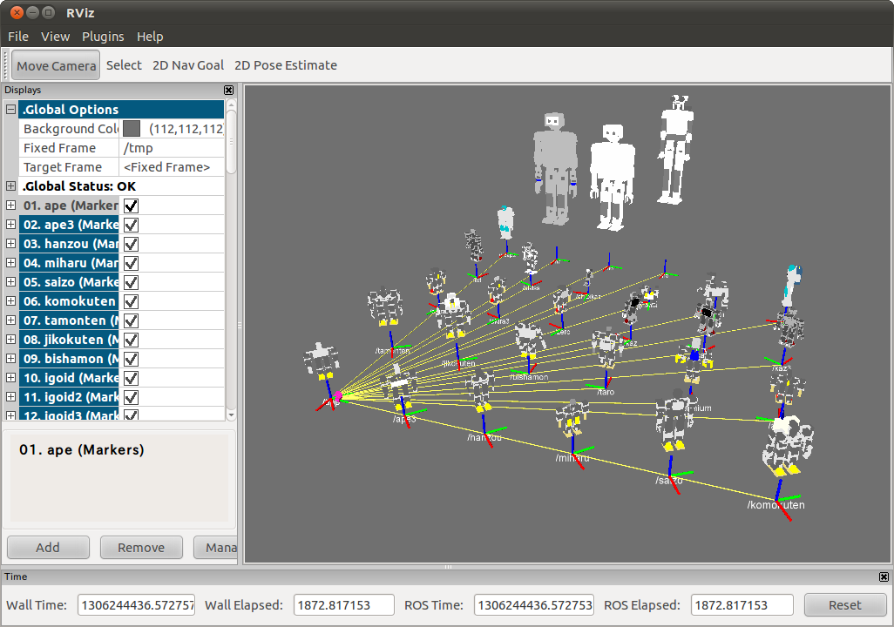

roseus_tutorials ROS Launch Files
=================================

**Description:** roseus_tutorials

**License:** BSD

all-robot.launch
----------------

.. code-block:: bash

  roslaunch roseus_tutorials all-robot.launch

This script displays robot model in rviz

  

Contents
########

.. code-block:: xml

  <launch>
    <node args="-d $(find roseus_tutorials)/launch/all-robot.vcg" name="rviz" pkg="rviz" type="rviz" />
    <node name="$(anon robot_publisher)" output="screen" pkg="roseus_tutorials" type="robot-publisher.l">
      <param name="robot" value="((ape) (ape3) (hanzou) (miharu))" />
      <param name="x" value="0" />
      <param name="y" value="0" />
    </node>
    <node name="$(anon robot_publisher)" output="screen" pkg="roseus_tutorials" type="robot-publisher.l">
      <param name="robot" value="((saizo) (komokuten) (tamonten) (jikokuten))" />
      <param name="x" value="0" />
      <param name="y" value="3200" />
    </node>
    <node name="$(anon robot_publisher)" output="screen" pkg="roseus_tutorials" type="robot-publisher.l">
      <param name="robot" value="((bishamon) (taro) (millennium) (akira))" />
      <param name="x" value="-1000" />
      <param name="y" value="1600" />
    </node>
    <node name="$(anon robot_publisher)" output="screen" pkg="roseus_tutorials" type="robot-publisher.l">
      <param name="robot" value="((akira2) (akira3) (zero) (kaz))" />
      <param name="x" value="-2000" />
      <param name="y" value="0" />
    </node>
    <node name="$(anon robot_publisher)" output="screen" pkg="roseus_tutorials" type="robot-publisher.l">
      <param name="robot" value="((kaz2) (kaz3) (tot) (alviss))" />
      <param name="x" value="-2000" />
      <param name="y" value="3200" />
    </node>
    <node name="$(anon robot_publisher)" output="screen" pkg="roseus_tutorials" type="robot-publisher.l">
      <param name="robot" value="((chibikaz) (tama) (tamaii) (hoap))" />
      <param name="x" value="-3000" />
      <param name="y" value="1600" />
    </node>
    <node name="$(anon robot_publisher)" output="screen" pkg="roseus_tutorials" type="robot-publisher.l">
      <param name="robot" value="((hoap2) (h7) (h6) (h5))" />
      <param name="x" value="-4000" />
      <param name="y" value="0" />
    </node>
    </launch>

kinect.launch
-------------

.. code-block:: bash

  roslaunch roseus_tutorials kinect.launch

This scripts start kinect node, 

.. code-block:: bash

  roseus "(jsk)" "(rbrain)" irtbvh.l "(hrp2jsk-simple)" "(test-kinect :robot *hrp2*)"

to control hrp2 robot from kinect captured skelton image
  

Contents
########

.. code-block:: xml

  <launch>
    <include file="$(find openni_camera)/launch/openni_node.launch" />
    
    
    <node name="openni_tracker" output="screen" pkg="openni_tracker" respawn="true" type="openni_tracker" />
    <node name="openni_dispairty_view" pkg="image_view" type="disparity_view">
      <remap from="image" to="/camera/depth/disparity" />
    </node>
    <node args="0 0 1.5 0 0 0 /map /openni_camera 100" name="map_openni_camera" pkg="tf" type="static_transform_publisher" />
    <node args="0 0 0 1.57 0 1.57 /openni_depth_frame /openni_depth 100" name="openni_depth_frame_openni_camera" pkg="tf" type="static_transform_publisher" />
    </launch>

aques-talk.launch
-----------------

.. code-block:: bash

  roslaunch roseus_tutorials aques-talk.launch

This script start sound synthesis deriver

Try

.. code-block:: bash

  rosrun roseus_tutorial aques_talk.l

for the demonstration

  

Contents
########

.. code-block:: xml

  <launch>
    <node name="soundplay_node" pkg="sound_play_jsk_patch" type="soundplay_node.py">
      <param name="command" value="$(find aques_talk)/text2wave-jp.sh" />
      <param name="frequency" value="8000" />
      <param name="channels" value="1" />
      <param name="command_args" value="-p aq_m4b.phont" />
    </node>
    </launch>

wiimote.launch
--------------

.. code-block:: bash

  roslaunch roseus_tutorials wiimote.launch

This script start wiimote driver.

.. code-block:: bash

  rosrun roseus_tutorial wiimote.l

to read the wiimote data from euslisp
  

Contents
########

.. code-block:: xml

  <launch>
    <node name="wiimote_node" output="screen" pkg="wiimote" type="wiimote_node.py" />
    </launch>

tutorials.launch
----------------

.. code-block:: bash

  roslaunch roseus_tutorials tutorials.launch

This script starts all launch file for demo programs
  

Contents
########

.. code-block:: xml

  <launch>
    <include file="$(find roseus_tutorials)/launch/usb-camera.launch" />
    <node args="0 0 0 0 0 0 base_link camera 100" name="camera_tf_sender" pkg="tf" type="static_transform_publisher" />
    <include file="$(find roseus_tutorials)/launch/image-view.launch" />
    <include file="$(find roseus_tutorials)/launch/template-track.launch" />
    <include file="$(find roseus_tutorials)/launch/face-detector-mono.launch" />
    <include file="$(find roseus_tutorials)/launch/saliency-track.launch" />
    <include file="$(find roseus_tutorials)/launch/camshiftdemo.launch" />
    <include file="$(find roseus_tutorials)/launch/cmvision.launch" />
    <include file="$(find roseus_tutorials)/launch/checkerboard-pose.launch" />
    <include file="$(find roseus_tutorials)/launch/checkerboard-detector.launch" />
    <include file="$(find roseus_tutorials)/launch/point-pose-extraction.launch" />
    <include file="$(find roseus_tutorials)/launch/aques-talk.launch" />
    <include file="$(find roseus_tutorials)/launch/reconfigure-gui.launch" />
  
    </launch>

face-detector-mono.launch
-------------------------

.. code-block:: bash

  roslaunch roseus_tutorials face-detector-mono.launch

This script starts face detection demo

.. code-block:: bash

  rosrun roseus_tutorial face-detector-mono.l

is sample client program.
  

Contents
########

.. code-block:: xml

  <launch>
    <node name="face_detector_mono" pkg="face_detector_mono" type="facedetect">
      <param name="cascade_name" value="$(find opencv2)/opencv/share/opencv/haarcascades/haarcascade_frontalface_alt.xml" />
      <param name="nested_cascade_name" value="$(find opencv2)/opencv/share/opencv/haarcascades/haarcascade_eye_tree_eyeglasses.xml" />
      <param name="scale" value="1.3" />
      <param name="display" value="true" />
      <remap from="/yarp_to_ros_image/yarp_to_ros_image" to="image_rect" />
    </node>
  
    </launch>

camshiftdemo.launch
-------------------

.. code-block:: bash

  roslaunch roseus_tutorials camshiftdemo.launch

This script starts camshift demo

.. code-block:: bash

  rosrun roseus_tutorial camshiftdemo.l

is sample client program.
  

Contents
########

.. code-block:: xml

  <launch>
    <node name="camshiftdemo" output="screen" pkg="jsk_perception" type="camshiftdemo">
      <remap from="image" to="image_rect_color" />
      <remap from="screenrectangle" to="image_rect_color/screenrectangle" />
    </node>
  
    </launch>

publish-marker.launch
---------------------

.. code-block:: bash

  roslaunch roseus_tutorials publish-marker.launch

checkerboard-pose.launch
------------------------

.. code-block:: bash

  roslaunch roseus_tutorials checkerboard-pose.launch

This script also starts checkerbord detection program

.. code-block:: bash

  rosrun roseus_tutorial checkerboard-pose.l

is sample client program. This node publish geometry_msgs::PoseStamped.
  

Contents
########

.. code-block:: xml

  <launch>
    <node name="checkerboard_pose" pkg="checkerboard_pose" type="cb_detector.py">
      <remap from="image_stream" to="image_rect" />
      <param name="corners_x" value="5" />
      <param name="corners_y" value="7" />
      <param name="spacing_x" value="0.03" />
      <param name="spacing_y" value="0.03" />
      <param name="publish_period" value="0.1" />
    </node>
    </launch>

crater_camera.launch
--------------------

.. code-block:: bash

  roslaunch roseus_tutorials crater_camera.launch

point-pose-extraction.launch
----------------------------

.. code-block:: bash

  roslaunch roseus_tutorials point-pose-extraction.launch

This script starts sift base object pose detection node.
defualt template image is `opencv logo <http://www.google.com/search?client=ubuntu&channel=fs&q=opencv&oe=utf-8&um=1&ie=UTF-8&tbm=isch&source=og&sa=N&hl=ja&tab=wi&biw=937&bih=638>`_.

.. code-block:: bash

  rosrun roseus_tutorial point-pose-extraction.l

to read the result data from euslisp program.
you need to launch image-view.launch before using this sample.
  

Contents
########

.. code-block:: xml

  <launch>
    <node name="image_siftnode" output="screen" pkg="imagesift" type="imagesurf">
      <remap from="image" to="image_rect_color" />
    </node>
  
    <node name="point_pose_extractor" pkg="jsk_perception" type="point_pose_extractor">
      <param name="child_frame_name" value="opencv_logo" />
      <param name="reprojection_threshold" value="10.0" />  
      <param name="distanceratio_threshold" value="0.60" /> 
      <param name="error_threshold" value="50.0" />
    </node>
  
    </launch>

template-track.launch
---------------------

.. code-block:: bash

  roslaunch roseus_tutorials template-track.launch

This script start template matching node.
Clink image on "template match view" window to set tracking target.
Use /match_template tab dynamic_reconfigure to configure template size, evaluation method, color space.
  

Contents
########

.. code-block:: xml

  <launch>
    <node name="template_track" output="screen" pkg="jsk_perception" type="matchtemplate.py">
      <remap from="reference" to="image_raw" />
      <remap from="search" to="image_raw" />
      <remap from="set_reference_point" to="tracking_result_image/screenpoint" />
      <remap from="debug_image" to="tracking_result_image" />
      <param name="default_template_width" value="30" />
      <param name="default_template_height" value="30" />
      <param name="default_search_width" value="60" />
      <param name="default_search_height" value="60" />
    </node>
    <node name="template_match_view" pkg="image_view2" type="image_view2">
      <remap from="image" to="tracking_result_image" />
      <param name="autosize" value="true" />
      <param name="window_name" value="template_match_view (click here to start tracking)" />
    </node>
  
    </launch>

checkerboard-detector.launch
----------------------------

.. code-block:: bash

  roslaunch roseus_tutorials checkerboard-detector.launch

This script starts checkerbord detection program

.. code-block:: bash

  rosrun roseus_tutorial checkerboard-detector.l

is sample client program
  

Contents
########

.. code-block:: xml

  <launch>
    <param name="single" value="1" />
    <param name="display" value="1" />
    <param name="rect0_size_x" value="0.030" />
    <param name="rect0_size_y" value="0.030" />
    <param name="grid0_size_x" value="7" />
    <param name="grid0_size_y" value="5" />
    <param name="type0" value="test_object" />
    <param name="translation0" value="0.060 0.090 0" />
    
    <param name="rotation0" value="1.0 0.0 0.0 0.0 -1.0 -6.278329e-07 0.0 6.278329e-07 -1.0" />
    <param name="frame_id" value="camera" />
    <node name="checkerboard_detector" pkg="checkerboard_detector" type="checkerboard_detector">
      <remap from="image" to="image_rect" />
    </node>
  
    </launch>

reconfigure-gui.launch
----------------------

.. code-block:: bash

  roslaunch roseus_tutorials reconfigure-gui.launch

This script starts reconfigure gui node
  

Contents
########

.. code-block:: xml

  <launch>
    <node name="dynamic_reconfigure" pkg="dynamic_reconfigure" type="reconfigure_gui" />
  
    </launch>

image-view.launch
-----------------

.. code-block:: bash

  roslaunch roseus_tutorials image-view.launch

This script start imageview2, which is jsk extention version of image view that supports
image marker capabilities in order to draw the reuslt, coordinates, annotation  of target object, on the image view.
  

Contents
########

.. code-block:: xml

  <launch>
    <node name="image_view2" output="screen" pkg="image_view2" type="image_view2">
      <remap from="image" to="image_rect_color" />
      <param name="autosize" value="true" />
      <param name="window_name" value="image_view2" />
    </node>
    </launch>

saliency-track.launch
---------------------

.. code-block:: bash

  roslaunch roseus_tutorials saliency-track.launch

This scripts starts saliency tracking node developed by UA.

.. code-block:: bash

  rosrun roseus_tutorials saliency-tracking.l

This is the sample client program for the node, which read result data from saliency tracking node and write the result on the image_view2.

  

Contents
########

.. code-block:: xml

  <launch>
    <node name="saliency_track" pkg="saliency_tracking" type="saliency_track">
      <remap from="image" to="image_rect_color" />
    </node>
  
    </launch>

usb-camera.launch
-----------------

.. code-block:: bash

  roslaunch roseus_tutorials usb-camera.launch

this script launch uvc camera driver and image proc, with launch/usb-camera.yaml calibration file.
  

Contents
########

.. code-block:: xml

  <launch>
    <node name="uvc_camera" output="screen" pkg="uvc_camera" type="camera_node">
      <param name="device" value="/dev/video0" />
      <param name="camera_info_url" type="string" value="file://$(find roseus_tutorials)/launch/usb-camera.yaml" />
      <param name="width" value="640" />
      <param name="height" value="480" />
      <param name="fps" value="30" />
      <param name="frame_id" value="camera" />
    </node>
    <node name="image_proc" output="screen" pkg="image_proc" type="image_proc" />
  
    </launch>

cmvision.launch
---------------

.. code-block:: bash

  roslaunch roseus_tutorials cmvision.launch

This scripts starts color extracking program (as known as cmvision)

.. code-block:: bash

  rosrun roseus_tutorials cmvision.l

This is the sample client program for the node, which read result data from the node and write the result on the image_view2.
Template color information is writting on `color_skin.txt` file

  

Contents
########

.. code-block:: xml

  <launch>
    <param name="/cmvision/color_file" value="$(find roseus_tutorials)/launch/color-skin.txt" />
    <node name="cmvision" pkg="cmvision" type="cmvision">
      
      <remap from="image" to="image_rect_color" />
    </node>
    <rosparam param="/cmvision">
     mean_shift_on: true
     debug_on: true
     spatial_radius_pix: 2.0
     color_radius_pix: 40.0
    </rosparam>
  
    </launch>

